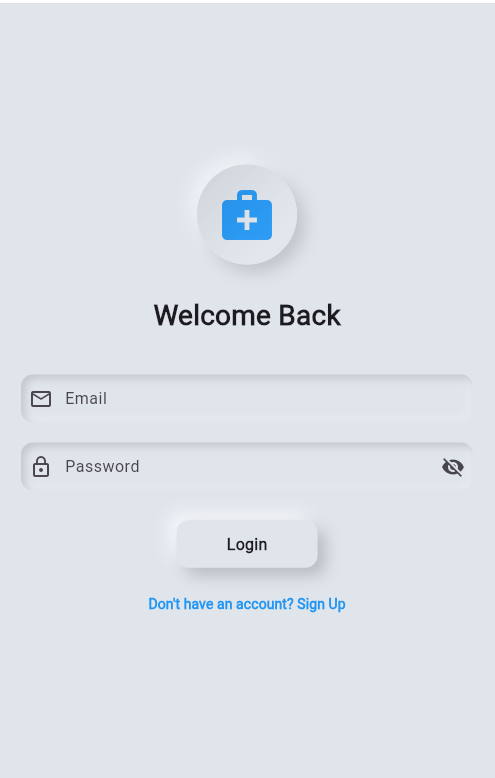
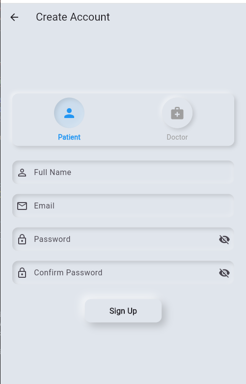
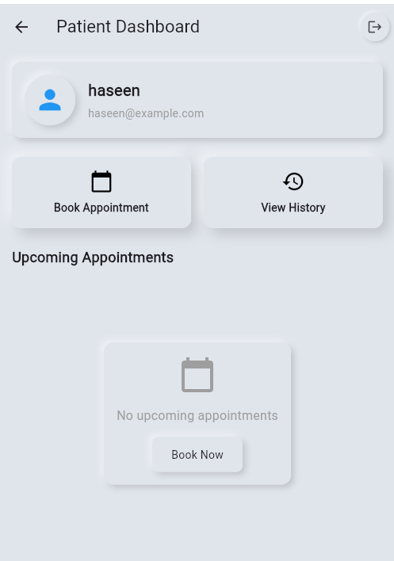
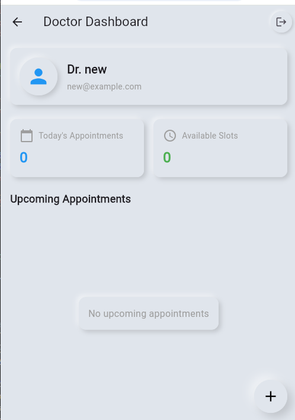
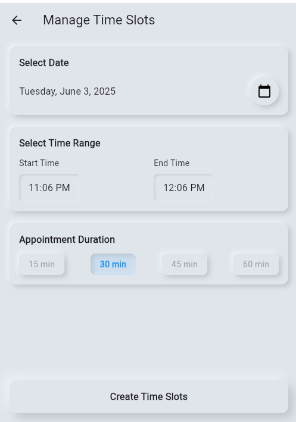
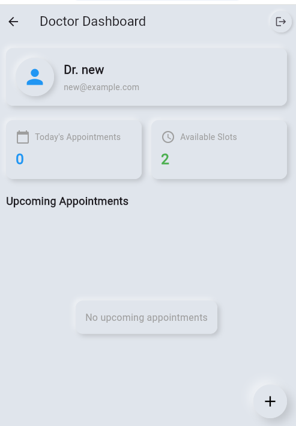
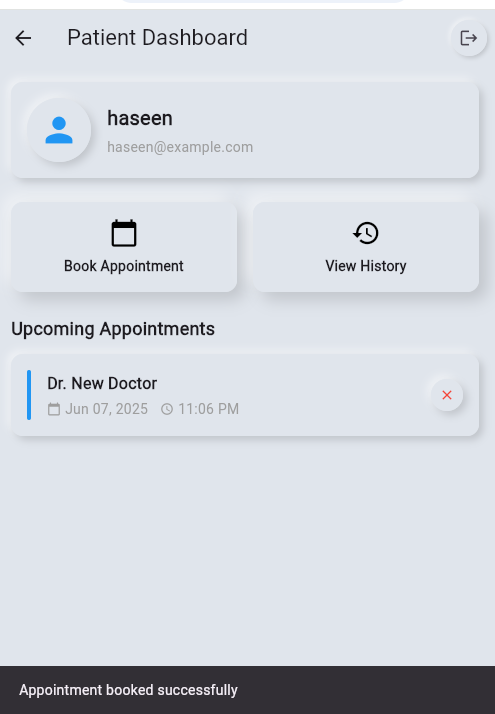

# Doctor Appointment App

A comprehensive Flutter application for managing doctor appointments with Firebase backend integration. This app provides separate interfaces for doctors and patients with real-time data synchronization.

## Table of Contents

1. [Overview](#overview)
2. [Screenshots](#screenshots)
3. [Features](#features)
4. [Architecture](#architecture)
5. [Installation](#installation)
6. [Configuration](#configuration)
7. [Usage](#usage)
8. [Project Structure](#project-structure)
9. [Database Schema](#database-schema)
10. [API Documentation](#api-documentation)
11. [UI/UX Design](#uiux-design)
12. [Security](#security)
13. [Testing](#testing)
14. [Deployment](#deployment)
15. [Contributing](#contributing)
16. [License](#license)

## Overview

The Doctor Appointment App is a modern, cross-platform mobile application built with Flutter that facilitates seamless appointment booking between doctors and patients. The app features a beautiful Neumorphic UI design and robust Firebase backend integration for real-time data management.

### Key Highlights
- **Cross-platform**: Runs on Android, iOS, Web, Windows, macOS, and Linux
- **Real-time synchronization**: Firebase Firestore for instant data updates
- **Role-based access**: Separate interfaces for doctors and patients
- **Modern UI**: Neumorphic design with smooth animations
- **Secure authentication**: Firebase Authentication with email/password
- **Scalable architecture**: Clean code structure with proper separation of concerns

## Screenshots

### App Flow Overview

<div align="center">

| Login Screen | Signup Screen | Home Screen |
|:---:|:---:|:---:|
|  |  |  |

</div>

### Doctor Interface

<div align="center">

| Doctor Dashboard | Slot Management | Doctor Dashboard |
|:---:|:---:|:---:|
|  |  |  |

</div>

### Patient Interface

<div align="center">

| Patient Dashboard | Slot Management |
|:---:|:---:|
|  |  |

</div>

### Key Features Showcase

- **🎨 Neumorphic Design**: Modern, elegant UI with soft shadows and depth
- **📱 Responsive Layout**: Optimized for all screen sizes and orientations
- **🔄 Real-time Updates**: Live synchronization of appointments and slots
- **🔐 Secure Authentication**: Role-based access with Firebase Authentication
- **📊 Dashboard Analytics**: Quick overview of appointments and statistics

## Features

### For Patients
- **User Registration & Login**: Secure account creation and authentication
- **Doctor Discovery**: Browse available doctors and their profiles
- **Appointment Booking**: Select doctors, dates, and available time slots
- **Appointment History**: View past and upcoming appointments
- **Real-time Updates**: Instant notifications for appointment status changes
- **Profile Management**: Update personal information and preferences

### For Doctors
- **Professional Dashboard**: Overview of daily appointments and statistics
- **Slot Management**: Create and manage available time slots
- **Appointment Overview**: View scheduled, completed, and cancelled appointments
- **Patient Information**: Access patient details for scheduled appointments
- **Schedule Flexibility**: Set working hours and availability
- **Real-time Notifications**: Instant updates on new bookings

### General Features
- **Responsive Design**: Adapts to different screen sizes and orientations
- **Offline Support**: Basic functionality available without internet
- **Data Validation**: Comprehensive input validation and error handling
- **Loading States**: Smooth loading indicators and progress feedback
- **Error Handling**: Graceful error management with user-friendly messages

## Architecture

The application follows a clean architecture pattern with clear separation of concerns:

### Technology Stack
- **Frontend**: Flutter 3.7.0+ with Dart
- **Backend**: Firebase (Firestore, Authentication, Storage)
- **State Management**: Provider pattern
- **UI Framework**: Flutter Neumorphic Plus for modern design
- **Database**: Cloud Firestore (NoSQL)
- **Authentication**: Firebase Authentication
- **Storage**: Firebase Storage (for future file uploads)

### Architecture Layers

#### 1. Presentation Layer (`lib/screens/`)
- **Splash Screen**: Initial loading and authentication check
- **Authentication Screens**: Login and signup interfaces
- **Patient Screens**: Dashboard, appointment booking, history
- **Doctor Screens**: Dashboard, slot management
- **Shared Components**: Reusable UI widgets

#### 2. Business Logic Layer (`lib/services/`)
- **AuthService**: Handles user authentication and role management
- **State Management**: Provider-based state management for reactive UI

#### 3. Data Layer (`lib/utils/`)
- **Firebase Schema Initializer**: Database structure setup
- **Database Initializer**: Sample data creation and management

#### 4. Model Layer (`lib/models/`)
- Data models for type-safe data handling (implicit in Firestore documents)

#### 5. Widget Layer (`lib/widgets/`)
- **Custom App Bar**: Platform-specific app bar implementation
- **Custom Back Button**: Cross-platform navigation component

### Design Patterns Used
- **Provider Pattern**: For state management and dependency injection
- **Repository Pattern**: Implicit through Firebase services
- **Factory Pattern**: For creating Firebase instances
- **Observer Pattern**: Through StreamBuilder for real-time updates
- **Singleton Pattern**: Firebase service instances

## Installation

### Prerequisites
- Flutter SDK 3.7.0 or higher
- Dart SDK 3.0.0 or higher
- Android Studio / VS Code with Flutter extensions
- Firebase CLI (for deployment)
- Git for version control

### Step-by-Step Installation

1. **Clone the Repository**
   ```bash
   git clone https://github.com/your-username/doctor_appointment_app.git
   cd doctor_appointment_app
   ```

2. **Install Flutter Dependencies**
   ```bash
   flutter pub get
   ```

3. **Firebase Setup**
   - Create a new Firebase project at [Firebase Console](https://console.firebase.google.com)
   - Enable Authentication with Email/Password provider
   - Create a Firestore database in production mode
   - Download configuration files:
     - `google-services.json` for Android (place in `android/app/`)
     - `GoogleService-Info.plist` for iOS (place in `ios/Runner/`)

4. **Configure Firebase for Flutter**
   ```bash
   flutter pub global activate flutterfire_cli
   flutterfire configure
   ```

5. **Run the Application**
   ```bash
   flutter run
   ```

### Platform-Specific Setup

#### Android
- Minimum SDK: 21 (Android 5.0)
- Target SDK: 34 (Android 14)
- Ensure `google-services.json` is in `android/app/`

#### iOS
- Minimum iOS version: 11.0
- Ensure `GoogleService-Info.plist` is in `ios/Runner/`
- Run `cd ios && pod install` if needed

#### Web
- Enable Firebase Hosting in Firebase Console
- Configure web app in Firebase project settings

## Configuration

### Firebase Configuration

#### 1. Firestore Security Rules
The app uses the following Firestore security rules (see `firestore.rules`):

```javascript
rules_version = '2';
service cloud.firestore {
  match /databases/{database}/documents {
    // Users collection
    match /users/{userId} {
      allow read: if request.auth != null;
      allow write: if request.auth != null && request.auth.uid == userId;
    }

    // Appointments collection
    match /appointments/{appointmentId} {
      allow read, write: if request.auth != null;
    }

    // Slots collection
    match /slots/{slotId} {
      allow read, write: if request.auth != null;
    }
  }
}
```

#### 2. Firebase Authentication
- Email/Password authentication enabled
- User roles stored in Firestore users collection
- Automatic role-based navigation after login

#### 3. Environment Variables
Create a `.env` file in the root directory:
```
FIREBASE_PROJECT_ID=your-project-id
FIREBASE_API_KEY=your-api-key
FIREBASE_APP_ID=your-app-id
```

## Usage

### Getting Started

1. **Launch the App**: The app starts with a splash screen showing the medical services icon
2. **Authentication**: Users are directed to login or can navigate to signup
3. **Role Selection**: During signup, users choose between "Doctor" or "Patient" roles
4. **Dashboard Access**: After authentication, users are redirected to role-specific dashboards

### For Patients

#### Registration and Login
1. Open the app and tap "Create Account" on the login screen
2. Select "Patient" role
3. Fill in personal information (name, email, password)
4. Confirm password and submit
5. Automatic login and redirect to Patient Dashboard

#### Booking an Appointment
1. From Patient Dashboard, tap "Book Appointment"
2. Select a doctor from the available list
3. Choose a date using the date picker
4. Select an available time slot
5. Confirm booking - appointment is immediately scheduled

#### Viewing Appointment History
1. From Patient Dashboard, tap "Appointment History"
2. View all past appointments with details:
   - Doctor name
   - Date and time
   - Appointment status
   - Duration

### For Doctors

#### Registration and Login
1. Open the app and tap "Create Account" on the login screen
2. Select "Doctor" role
3. Fill in professional information
4. Complete registration and login

#### Managing Time Slots
1. From Doctor Dashboard, tap "Manage Slots"
2. Select date for slot creation
3. Set start and end times
4. Choose slot duration (15, 30, 45, or 60 minutes)
5. Tap "Create Time Slots" to generate available slots

#### Viewing Appointments
1. Doctor Dashboard shows:
   - Today's appointments count
   - Upcoming appointments list
   - Available slots count
2. Real-time updates when patients book appointments

### Navigation Flow

```
Splash Screen
    ↓
Login Screen ←→ Signup Screen
    ↓
Role-based Dashboard
    ↓
Patient Dashboard          Doctor Dashboard
    ↓                          ↓
├─ Book Appointment       ├─ Manage Slots
├─ Appointment History    ├─ View Appointments
└─ Profile Settings       └─ Profile Settings
```

## Project Structure

```
doctor_appointment_app/
├── android/                 # Android-specific files
├── ios/                     # iOS-specific files
├── web/                     # Web-specific files
├── windows/                 # Windows-specific files
├── linux/                   # Linux-specific files
├── macos/                   # macOS-specific files
├── lib/                     # Main application code
│   ├── main.dart           # App entry point
│   ├── firebase_options.dart # Firebase configuration
│   ├── models/             # Data models (future expansion)
│   ├── screens/            # UI screens
│   │   ├── splash_screen.dart
│   │   ├── login_screen.dart
│   │   ├── signup_screen.dart
│   │   ├── doctor/
│   │   │   ├── doctor_dashboard.dart
│   │   │   └── slot_management.dart
│   │   └── patient/
│   │       ├── patient_dashboard.dart
│   │       ├── book_appointment.dart
│   │       └── appointment_history.dart
│   ├── services/           # Business logic services
│   │   └── auth_service.dart
│   ├── utils/              # Utility classes
│   │   ├── database_initializer.dart
│   │   └── firebase_schema_initializer.dart
│   └── widgets/            # Reusable UI components
│       ├── custom_app_bar.dart
│       └── custom_back_button.dart
├── test/                   # Unit and widget tests
├── pubspec.yaml           # Dependencies and metadata
├── firebase.json          # Firebase configuration
├── firestore.rules        # Firestore security rules
├── firestore.indexes.json # Firestore indexes
└── README.md              # This documentation
```

### Key Files Description

#### Core Application Files
- **`main.dart`**: Application entry point, Firebase initialization, and app configuration
- **`firebase_options.dart`**: Auto-generated Firebase configuration for all platforms

#### Screen Files
- **`splash_screen.dart`**: Loading screen with authentication state checking
- **`login_screen.dart`**: User authentication interface with email/password
- **`signup_screen.dart`**: User registration with role selection
- **`doctor_dashboard.dart`**: Doctor's main interface with appointment overview
- **`patient_dashboard.dart`**: Patient's main interface with quick actions
- **`slot_management.dart`**: Doctor's time slot creation and management
- **`book_appointment.dart`**: Patient's appointment booking interface
- **`appointment_history.dart`**: Patient's past appointments view

#### Service Files
- **`auth_service.dart`**: Authentication logic, user management, and role handling

#### Utility Files
- **`database_initializer.dart`**: Database setup and sample data creation
- **`firebase_schema_initializer.dart`**: Comprehensive database schema initialization

#### Widget Files
- **`custom_app_bar.dart`**: Cross-platform app bar component
- **`custom_back_button.dart`**: Platform-specific back navigation button

## Database Schema

The application uses Firebase Firestore as its primary database. Below is the detailed schema for all collections:

### Collections Overview

#### 1. Users Collection (`users`)
Stores basic user information for both doctors and patients.

```javascript
{
  "userId": "auto-generated-id",
  "name": "string",           // User's full name
  "email": "string",          // User's email address
  "role": "string",           // "doctor" or "patient"
  "createdAt": "timestamp",   // Account creation time
  "lastLogin": "timestamp",   // Last login time (optional)
  "isActive": "boolean"       // Account status (optional)
}
```

#### 2. Doctors Collection (`doctors`)
Extended information for doctor profiles.

```javascript
{
  "doctorId": "auto-generated-id",
  "userId": "string",         // Reference to users collection
  "name": "string",           // Doctor's full name
  "specialization": "string", // Medical specialization
  "experience": "number",     // Years of experience
  "qualifications": ["array"], // List of qualifications
  "bio": "string",            // Professional biography
  "profileImageUrl": "string", // Profile picture URL
  "clinicAddress": "string",  // Clinic/hospital address
  "consultationFee": "number", // Fee per consultation
  "rating": "number",         // Average rating (0-5)
  "totalReviews": "number",   // Total number of reviews
  "availableDays": ["array"], // Working days
  "workingHours": {
    "start": "string",        // Start time (HH:MM format)
    "end": "string"           // End time (HH:MM format)
  },
  "contactInfo": {
    "email": "string",
    "phone": "string"
  },
  "isVerified": "boolean",    // Verification status
  "isActive": "boolean",      // Active status
  "createdAt": "timestamp"
}
```

#### 3. Patients Collection (`patients`)
Extended information for patient profiles.

```javascript
{
  "patientId": "auto-generated-id",
  "userId": "string",         // Reference to users collection
  "name": "string",           // Patient's full name
  "dateOfBirth": "timestamp", // Date of birth
  "gender": "string",         // Gender
  "phoneNumber": "string",    // Contact number
  "address": "string",        // Home address
  "emergencyContact": {
    "name": "string",
    "phone": "string",
    "relationship": "string"
  },
  "medicalHistory": ["array"], // List of medical conditions
  "allergies": ["array"],     // List of allergies
  "currentMedications": ["array"], // Current medications
  "bloodGroup": "string",     // Blood group
  "profileImageUrl": "string", // Profile picture URL
  "createdAt": "timestamp",
  "lastUpdated": "timestamp"
}
```

#### 4. Slots Collection (`slots`)
Available time slots created by doctors.

```javascript
{
  "slotId": "auto-generated-id",
  "doctorId": "string",       // Reference to doctor
  "dateTime": "timestamp",    // Slot date and time
  "durationMinutes": "number", // Duration in minutes
  "isBooked": "boolean",      // Booking status
  "patientId": "string",      // Patient ID if booked (optional)
  "createdAt": "timestamp",
  "lastUpdated": "timestamp"
}
```

#### 5. Appointments Collection (`appointments`)
Scheduled appointments between doctors and patients.

```javascript
{
  "appointmentId": "auto-generated-id",
  "slotId": "string",         // Reference to slot
  "patientId": "string",      // Reference to patient
  "doctorId": "string",       // Reference to doctor
  "dateTime": "timestamp",    // Appointment date and time
  "durationMinutes": "number", // Duration in minutes
  "patientName": "string",    // Patient's name (denormalized)
  "doctorName": "string",     // Doctor's name (denormalized)
  "status": "string",         // "scheduled", "completed", "cancelled", "no-show"
  "symptoms": "string",       // Patient's symptoms (optional)
  "notes": "string",          // Doctor's notes (optional)
  "followUpDate": "timestamp", // Follow-up date (optional)
  "paymentStatus": "string",  // "pending", "completed", "refunded"
  "paymentAmount": "number",  // Payment amount
  "paymentMethod": "string",  // Payment method
  "meetingType": "string",    // "in-person", "video", "phone"
  "meetingLink": "string",    // Video call link (optional)
  "createdAt": "timestamp",
  "lastUpdated": "timestamp"
}
```

#### 6. Medical Records Collection (`medical_records`)
Patient medical records and history.

```javascript
{
  "recordId": "auto-generated-id",
  "patientId": "string",      // Reference to patient
  "doctorId": "string",       // Reference to doctor
  "appointmentId": "string",  // Reference to appointment
  "diagnosis": "string",      // Medical diagnosis
  "prescription": ["array"],  // List of prescribed medications
  "labResults": ["array"],    // Lab test results
  "symptoms": "string",       // Reported symptoms
  "treatment": "string",      // Treatment provided
  "followUpInstructions": "string", // Follow-up instructions
  "attachments": ["array"],   // File attachments
  "createdAt": "timestamp",
  "lastUpdated": "timestamp"
}
```

#### 7. Reviews Collection (`reviews`)
Patient reviews and ratings for doctors.

```javascript
{
  "reviewId": "auto-generated-id",
  "patientId": "string",      // Reference to patient
  "doctorId": "string",       // Reference to doctor
  "appointmentId": "string",  // Reference to appointment
  "rating": "number",         // Rating (1-5)
  "comment": "string",        // Review comment
  "isAnonymous": "boolean",   // Anonymous review flag
  "createdAt": "timestamp"
}
```

#### 8. Notifications Collection (`notifications`)
System notifications for users.

```javascript
{
  "notificationId": "auto-generated-id",
  "userId": "string",         // Target user ID
  "title": "string",          // Notification title
  "message": "string",        // Notification message
  "type": "string",           // "appointment", "reminder", "system"
  "isRead": "boolean",        // Read status
  "actionUrl": "string",      // Deep link URL (optional)
  "createdAt": "timestamp"
}
```

#### 9. Settings Collection (`settings`)
Application-wide settings and configuration.

```javascript
{
  "settingId": "app_settings",
  "appointmentDurations": ["array"], // Available durations [15, 30, 45, 60]
  "workingHours": {
    "start": "string",        // Default start time
    "end": "string"           // Default end time
  },
  "cancellationPolicy": "string", // Cancellation policy text
  "termsAndConditions": "string", // Terms and conditions
  "privacyPolicy": "string",  // Privacy policy
  "supportEmail": "string",   // Support contact email
  "supportPhone": "string",   // Support contact phone
  "lastUpdated": "timestamp"
}
```

### Database Relationships

```
Users (1) ←→ (1) Doctors/Patients
Users (1) ←→ (N) Appointments
Doctors (1) ←→ (N) Slots
Doctors (1) ←→ (N) Appointments
Patients (1) ←→ (N) Appointments
Slots (1) ←→ (1) Appointments
Appointments (1) ←→ (N) Medical Records
Doctors (1) ←→ (N) Reviews
Patients (1) ←→ (N) Reviews
Users (1) ←→ (N) Notifications
```

### Firestore Indexes

The application requires the following composite indexes:

```javascript
// Appointments by doctor and date
{
  "collectionGroup": "appointments",
  "queryScope": "COLLECTION",
  "fields": [
    {"fieldPath": "doctorId", "order": "ASCENDING"},
    {"fieldPath": "dateTime", "order": "ASCENDING"}
  ]
}

// Slots by doctor and availability
{
  "collectionGroup": "slots",
  "queryScope": "COLLECTION",
  "fields": [
    {"fieldPath": "doctorId", "order": "ASCENDING"},
    {"fieldPath": "isBooked", "order": "ASCENDING"},
    {"fieldPath": "dateTime", "order": "ASCENDING"}
  ]
}

// Appointments by patient and date
{
  "collectionGroup": "appointments",
  "queryScope": "COLLECTION",
  "fields": [
    {"fieldPath": "patientId", "order": "ASCENDING"},
    {"fieldPath": "dateTime", "order": "DESCENDING"}
  ]
}
```

## API Documentation

The application uses Firebase services as its backend API. Below are the key operations:

### Authentication API

#### Sign Up
```dart
Future<bool> signUp(String email, String password, String name, UserRole role)
```
- Creates user account in Firebase Authentication
- Stores user profile in Firestore users collection
- Returns success/failure status

#### Sign In
```dart
Future<bool> signIn(String email, String password)
```
- Authenticates user with Firebase
- Loads user role from Firestore
- Returns success/failure status

#### Sign Out
```dart
Future<void> signOut()
```
- Signs out user from Firebase Authentication
- Clears local user state

### User Management API

#### Load User Role
```dart
Future<void> _loadUserRole()
```
- Fetches user role from Firestore
- Updates local state with role information

### Appointment Management API

#### Book Appointment
```dart
Future<void> _bookAppointment(String slotId, String patientId, String doctorId)
```
- Creates new appointment document
- Updates slot as booked
- Includes patient and doctor information

#### Get Available Slots
```dart
Stream<QuerySnapshot> _getAvailableSlotsStream(String doctorId, DateTime selectedDate)
```
- Returns real-time stream of available slots
- Filters by doctor and date
- Excludes already booked slots

#### Get Appointments
```dart
Stream<QuerySnapshot> _getUpcomingAppointmentsStream(String userId)
Stream<QuerySnapshot> _getPastAppointmentsStream(String patientId)
Stream<QuerySnapshot> _getTodayAppointmentsStream(String doctorId)
```
- Returns real-time streams of appointments
- Filtered by user role and date ranges
- Ordered by date/time

### Slot Management API

#### Create Time Slots
```dart
Future<void> _createTimeSlots(String doctorId)
```
- Generates time slots based on date range and duration
- Batch creates multiple slots in Firestore
- Validates time ranges and conflicts

#### Get Doctor Slots
```dart
Stream<QuerySnapshot> _getAvailableSlotsStream(String doctorId)
```
- Returns doctor's available slots
- Real-time updates for booking status

### Data Validation

#### Input Validation Rules
- **Email**: Must be valid email format
- **Password**: Minimum 6 characters
- **Name**: Required, non-empty string
- **Date/Time**: Must be future date for appointments
- **Duration**: Must be valid duration (15, 30, 45, 60 minutes)

#### Business Logic Validation
- Slots cannot overlap for same doctor
- Appointments cannot be booked in the past
- Users can only book one appointment per slot
- Doctors cannot book appointments with themselves

## UI/UX Design

### Design System

#### Color Palette
- **Primary Background**: `#E0E5EC` (Soft white-grey)
- **Neumorphic Shadow**: Calculated based on light source
- **Text Primary**: `#000000` (Black)
- **Text Secondary**: `#666666` (Grey)
- **Accent Color**: `#2196F3` (Blue for medical theme)
- **Success**: `#4CAF50` (Green)
- **Error**: `#F44336` (Red)
- **Warning**: `#FF9800` (Orange)

#### Typography
- **Primary Font**: System default (Roboto on Android, San Francisco on iOS)
- **Heading Sizes**: 24px, 20px, 18px, 16px
- **Body Text**: 14px, 16px
- **Caption**: 12px

#### Neumorphic Design Principles
- **Depth**: 4-8px for most elements
- **Intensity**: 0.6-0.8 for subtle shadows
- **Light Source**: Top-left for consistency
- **Border Radius**: 12px for rounded corners
- **Concave/Convex**: Buttons convex, input fields concave

### Screen Layouts

#### Splash Screen
- Centered medical icon with neumorphic circle
- App title below icon
- Loading indicator
- Smooth transition to main app

#### Authentication Screens
- Centered form layout
- Neumorphic input fields with icons
- Role selection with visual indicators
- Consistent button styling
- Form validation with error messages

#### Dashboard Layouts
- Card-based information display
- Quick action buttons
- Statistics overview
- Real-time data updates
- Responsive grid layout

#### Appointment Booking
- Step-by-step wizard interface
- Doctor selection with profiles
- Calendar date picker
- Time slot grid layout
- Confirmation screen

### Responsive Design

#### Breakpoints
- **Mobile**: < 600px width
- **Tablet**: 600px - 1024px width
- **Desktop**: > 1024px width

#### Adaptive Layouts
- Single column on mobile
- Two-column layout on tablet
- Multi-column layout on desktop
- Flexible grid systems
- Scalable text and icons

### Accessibility Features

#### Screen Reader Support
- Semantic HTML structure
- Proper heading hierarchy
- Alt text for images
- ARIA labels for interactive elements

#### Keyboard Navigation
- Tab order optimization
- Focus indicators
- Keyboard shortcuts
- Skip navigation links

#### Visual Accessibility
- High contrast ratios
- Scalable fonts
- Color-blind friendly palette
- Clear visual hierarchy

## Security

### Authentication Security

#### Firebase Authentication
- Secure email/password authentication
- Password strength requirements (minimum 6 characters)
- Account verification via email
- Secure session management
- Automatic token refresh

#### User Role Management
- Role-based access control (RBAC)
- Server-side role validation
- Secure role assignment during registration
- Role-specific UI rendering

### Data Security

#### Firestore Security Rules
```javascript
rules_version = '2';
service cloud.firestore {
  match /databases/{database}/documents {
    // Users can only read/write their own data
    match /users/{userId} {
      allow read: if request.auth != null;
      allow write: if request.auth != null && request.auth.uid == userId;
    }

    // Appointments accessible to involved parties
    match /appointments/{appointmentId} {
      allow read, write: if request.auth != null &&
        (resource.data.patientId == request.auth.uid ||
         resource.data.doctorId == request.auth.uid);
    }

    // Slots readable by all authenticated users, writable by doctors
    match /slots/{slotId} {
      allow read: if request.auth != null;
      allow write: if request.auth != null &&
        get(/databases/$(database)/documents/users/$(request.auth.uid)).data.role == 'doctor';
    }
  }
}
```

#### Data Validation
- Input sanitization on client and server
- Type checking for all data fields
- Range validation for dates and times
- Email format validation
- SQL injection prevention (NoSQL database)

#### Privacy Protection
- Personal data encryption in transit (HTTPS)
- Secure data storage in Firebase
- GDPR compliance considerations
- Data minimization principles
- User consent management

### Network Security

#### HTTPS/TLS
- All communications encrypted with TLS 1.3
- Certificate pinning for API calls
- Secure WebSocket connections for real-time updates

#### API Security
- Firebase SDK handles authentication tokens
- Automatic token refresh
- Request rate limiting
- CORS configuration for web deployment

## Testing

### Testing Strategy

#### Unit Tests
- Service layer testing (AuthService)
- Utility function testing
- Data validation testing
- Business logic verification

#### Widget Tests
- UI component testing
- User interaction testing
- Form validation testing
- Navigation testing

#### Integration Tests
- End-to-end user flows
- Firebase integration testing
- Cross-platform compatibility
- Performance testing

### Test Structure

```
test/
├── unit/
│   ├── services/
│   │   └── auth_service_test.dart
│   ├── utils/
│   │   ├── database_initializer_test.dart
│   │   └── firebase_schema_initializer_test.dart
│   └── models/
├── widget/
│   ├── screens/
│   │   ├── login_screen_test.dart
│   │   ├── signup_screen_test.dart
│   │   └── dashboard_test.dart
│   └── widgets/
│       ├── custom_app_bar_test.dart
│       └── custom_back_button_test.dart
└── integration/
    ├── authentication_flow_test.dart
    ├── appointment_booking_test.dart
    └── slot_management_test.dart
```

### Running Tests

```bash
# Run all tests
flutter test

# Run unit tests only
flutter test test/unit/

# Run widget tests only
flutter test test/widget/

# Run integration tests
flutter test test/integration/

# Run tests with coverage
flutter test --coverage
```

### Test Coverage Goals
- **Unit Tests**: 90%+ coverage for business logic
- **Widget Tests**: 80%+ coverage for UI components
- **Integration Tests**: 100% coverage for critical user flows

## Deployment

### Development Environment

#### Local Development
```bash
# Start development server
flutter run

# Hot reload enabled by default
# Debug mode with detailed error messages
# Firebase emulator for local testing (optional)
```

#### Debug Configuration
- Debug mode enabled
- Detailed error logging
- Firebase debug mode
- Performance monitoring disabled

### Staging Environment

#### Firebase Staging Project
- Separate Firebase project for staging
- Test data and configurations
- Staging-specific environment variables
- Limited user access

#### Staging Deployment
```bash
# Build for staging
flutter build web --dart-define=ENVIRONMENT=staging

# Deploy to Firebase Hosting
firebase deploy --project staging
```

### Production Environment

#### Production Deployment Steps

1. **Code Review and Testing**
   ```bash
   # Run all tests
   flutter test

   # Build for production
   flutter build apk --release
   flutter build ios --release
   flutter build web --release
   ```

2. **Android Deployment**
   ```bash
   # Build signed APK
   flutter build apk --release

   # Build App Bundle for Play Store
   flutter build appbundle --release
   ```

3. **iOS Deployment**
   ```bash
   # Build for iOS
   flutter build ios --release

   # Archive and upload to App Store Connect
   ```

4. **Web Deployment**
   ```bash
   # Build for web
   flutter build web --release

   # Deploy to Firebase Hosting
   firebase deploy --only hosting
   ```

#### Production Configuration
- Release mode builds
- Minified code
- Obfuscated code for security
- Performance monitoring enabled
- Crash reporting enabled
- Analytics enabled

### CI/CD Pipeline

#### GitHub Actions Workflow
```yaml
name: CI/CD Pipeline

on:
  push:
    branches: [main, develop]
  pull_request:
    branches: [main]

jobs:
  test:
    runs-on: ubuntu-latest
    steps:
      - uses: actions/checkout@v3
      - uses: subosito/flutter-action@v2
      - run: flutter pub get
      - run: flutter test
      - run: flutter analyze

  build:
    needs: test
    runs-on: ubuntu-latest
    steps:
      - uses: actions/checkout@v3
      - uses: subosito/flutter-action@v2
      - run: flutter pub get
      - run: flutter build web --release
      - run: firebase deploy --token ${{ secrets.FIREBASE_TOKEN }}
```

### Monitoring and Analytics

#### Performance Monitoring
- Firebase Performance Monitoring
- App startup time tracking
- Network request monitoring
- Screen rendering performance

#### Crash Reporting
- Firebase Crashlytics
- Automatic crash detection
- Detailed crash reports
- User impact analysis

#### Analytics
- Firebase Analytics
- User behavior tracking
- Feature usage statistics
- Conversion funnel analysis

## Contributing

### Development Guidelines

#### Code Style
- Follow Dart/Flutter style guidelines
- Use meaningful variable and function names
- Add comments for complex logic
- Maintain consistent indentation (2 spaces)

#### Git Workflow
```bash
# Create feature branch
git checkout -b feature/appointment-reminders

# Make changes and commit
git add .
git commit -m "feat: add appointment reminder notifications"

# Push and create pull request
git push origin feature/appointment-reminders
```

#### Commit Message Format
```
type(scope): description

feat: new feature
fix: bug fix
docs: documentation changes
style: formatting changes
refactor: code refactoring
test: adding tests
chore: maintenance tasks
```

### Pull Request Process

1. **Create Feature Branch**
   - Branch from `develop`
   - Use descriptive branch names
   - Keep changes focused and small

2. **Development**
   - Write tests for new features
   - Update documentation
   - Follow coding standards
   - Test on multiple platforms

3. **Pull Request**
   - Provide clear description
   - Include screenshots for UI changes
   - Reference related issues
   - Request appropriate reviewers

4. **Code Review**
   - Address reviewer feedback
   - Ensure all tests pass
   - Update documentation if needed
   - Squash commits if necessary

5. **Merge**
   - Merge to `develop` branch
   - Delete feature branch
   - Deploy to staging for testing

### Issue Reporting

#### Bug Reports
- Use bug report template
- Include steps to reproduce
- Provide device/platform information
- Include screenshots or videos
- Specify expected vs actual behavior

#### Feature Requests
- Use feature request template
- Describe the problem being solved
- Provide detailed requirements
- Include mockups if applicable
- Consider implementation complexity

## License

### MIT License

```
MIT License

Copyright (c) 2024 Doctor Appointment App

Permission is hereby granted, free of charge, to any person obtaining a copy
of this software and associated documentation files (the "Software"), to deal
in the Software without restriction, including without limitation the rights
to use, copy, modify, merge, publish, distribute, sublicense, and/or sell
copies of the Software, and to permit persons to whom the Software is
furnished to do so, subject to the following conditions:

The above copyright notice and this permission notice shall be included in all
copies or substantial portions of the Software.

THE SOFTWARE IS PROVIDED "AS IS", WITHOUT WARRANTY OF ANY KIND, EXPRESS OR
IMPLIED, INCLUDING BUT NOT LIMITED TO THE WARRANTIES OF MERCHANTABILITY,
FITNESS FOR A PARTICULAR PURPOSE AND NONINFRINGEMENT. IN NO EVENT SHALL THE
AUTHORS OR COPYRIGHT HOLDERS BE LIABLE FOR ANY CLAIM, DAMAGES OR OTHER
LIABILITY, WHETHER IN AN ACTION OF CONTRACT, TORT OR OTHERWISE, ARISING FROM,
OUT OF OR IN CONNECTION WITH THE SOFTWARE OR THE USE OR OTHER DEALINGS IN THE
SOFTWARE.
```

### Third-Party Licenses

#### Flutter Framework
- BSD 3-Clause License
- Copyright (c) 2017, Google Inc.

#### Firebase SDK
- Apache License 2.0
- Copyright (c) 2016, Google Inc.

#### Flutter Neumorphic Plus
- MIT License
- Copyright (c) 2021, Neumorphic Plus Contributors

#### Provider Package
- MIT License
- Copyright (c) 2019, Remi Rousselet

---

## Support and Contact

### Technical Support
- **Email**: mrhaseenullah1@gmail.com
- **Documentation**: [GitHub Wiki](https://github.com/MrHaseenullah/doctor_appointment_app/wiki)
- **Issues**: [GitHub Issues](https://github.com/MrHaseenullah/doctor_appointment_app/issues)


### Maintainers
- **Lead Developer**: Haseen ullah
- **UI/UX Designer**: Haseen ullah
- **DevOps Engineer**: Haseen ullah

---

*Last updated: June 2025*
*Version: 1.0.0*
