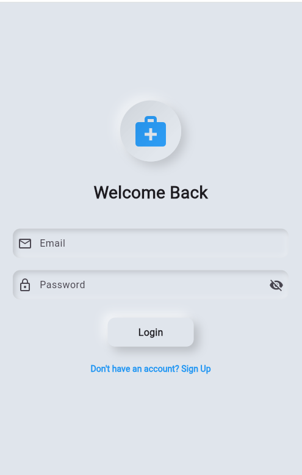
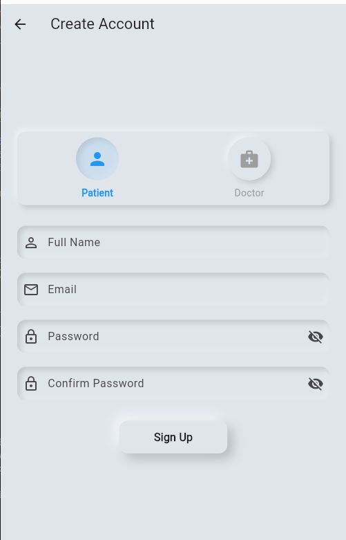
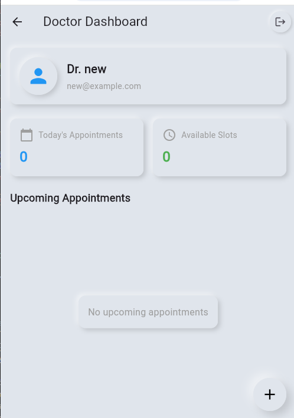

# Screenshot Setup Guide

## Step-by-Step Instructions to Add Screenshots to Your GitHub Repository

### Step 1: Prepare Your Screenshots

1. **Take Screenshots** of your app on different devices/platforms:
   - Mobile screenshots (Android/iOS)
   - Web screenshots (if applicable)
   - Desktop screenshots (Windows/macOS/Linux)

2. **Recommended Screenshot Names**:
   ```
   splash_screen.png
   login_screen.png
   signup_screen.png
   patient_dashboard.png
   doctor_dashboard.png
   book_appointment.png
   appointment_history.png
   slot_management.png
   ```

3. **Image Requirements**:
   - **Format**: PNG or JPG (PNG recommended for better quality)
   - **Size**: Recommended width 300-800px for mobile, 1200px+ for desktop
   - **Quality**: High resolution but optimized for web (under 1MB each)

### Step 2: Add Screenshots to Your Project

1. **Copy your screenshot files** to this folder:
   ```
   c:\Users\Haseen ullah\Downloads\Video\doctor_appointment_app\screenshots\
   ```

2. **File Structure** should look like:
   ```
   doctor_appointment_app/
   ├── screenshots/
   │   ├── splash_screen.png
   │   ├── login_screen.png
   │   ├── signup_screen.png
   │   ├── patient_dashboard.png
   │   ├── doctor_dashboard.png
   │   ├── book_appointment.png
   │   ├── appointment_history.png
   │   └── slot_management.png
   ├── lib/
   ├── README.md
   └── ...
   ```

### Step 3: Push Screenshots to GitHub

After adding your screenshots to the `screenshots/` folder, run these commands:

```bash
# Navigate to your project directory
cd "c:\Users\Haseen ullah\Downloads\Video\doctor_appointment_app"

# Add all new files (including screenshots)
git add .

# Commit the changes
git commit -m "docs: Add app screenshots for README documentation"

# Push to GitHub
git push origin main
```

### Step 4: Verify Screenshots Display

1. Go to your GitHub repository: https://github.com/MrHaseenullah/doctor-appointment-app
2. Navigate to the README.md file
3. Scroll down to the "Screenshots" section
4. Your images should now display in a nice table format

### Alternative Methods

#### Method 1: GitHub Issues (Quick Upload)
1. Go to your GitHub repository
2. Create a new issue (you can delete it later)
3. Drag and drop your images into the issue description
4. GitHub will generate URLs like: `https://user-images.githubusercontent.com/...`
5. Copy these URLs and use them in your README

#### Method 2: GitHub Wiki
1. Go to your repository's Wiki tab
2. Upload images there
3. Use the generated URLs in your README

#### Method 3: External Image Hosting
- Use services like Imgur, Cloudinary, or GitHub Pages
- Upload images and get public URLs
- Reference these URLs in your README

### Screenshot Tips

#### For Mobile Apps:
- Use device frames for better presentation
- Show different screen sizes (phone, tablet)
- Include both light and dark themes if available

#### For Web Apps:
- Show responsive design on different screen sizes
- Include browser chrome for context
- Demonstrate key user interactions

#### Image Optimization:
```bash
# Use tools like ImageOptim, TinyPNG, or online compressors
# Target file sizes under 500KB for faster loading
```

### Markdown Syntax for Images

#### Basic Image:
```markdown

```

#### Image with Link:
```markdown
[](https://your-app-url.com)
```

#### Centered Image:
```markdown
<div align="center">
  
</div>
```

#### Image Table (as used in README):
```markdown
| Screen 1 | Screen 2 | Screen 3 |
|:---:|:---:|:---:|
|  |  |  |
```

### Troubleshooting

#### Images Not Showing:
1. Check file paths are correct
2. Ensure images are committed and pushed to GitHub
3. Verify image file names match exactly (case-sensitive)
4. Make sure images are in the `screenshots/` folder

#### Images Too Large:
1. Resize images to appropriate dimensions
2. Compress images to reduce file size
3. Use PNG for screenshots, JPG for photos

#### GitHub Not Updating:
1. Clear browser cache
2. Wait a few minutes for GitHub to process
3. Check if commit was successful

### Example README Section

Here's how your screenshots will appear in the README:

```markdown
## Screenshots

### App Flow Overview
| Splash Screen | Login Screen | Signup Screen |
|:---:|:---:|:---:|
|  |  |  |

### Patient Interface
| Dashboard | Book Appointment | History |
|:---:|:---:|:---:|
|  |  |  |
```

This will create a professional-looking grid of screenshots that showcases your app's interface and functionality!
